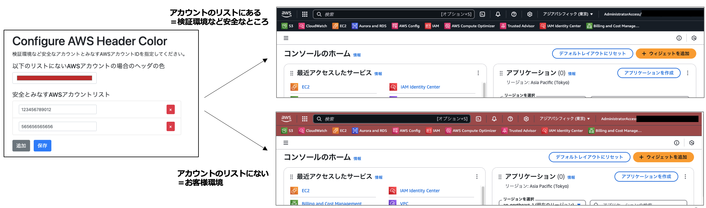
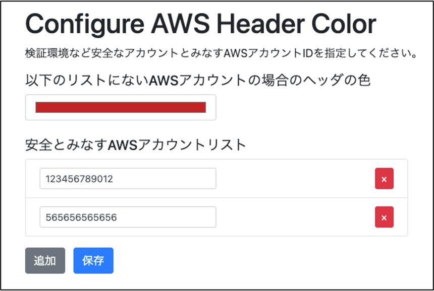

# Anzen AWS Console Header

AWSコンソールのヘッダー色を変更し、作業に注意が必要なAWSアカウントを視覚的に識別しやすくするChrome拡張機能です。

本番環境と検証環境を見誤るといった作業ミスを緩和するためのものです。

AWSアカウントIDごとにヘッダー色を指定するのではなく、***指定したアカウントIDリスト以外***の場合に色を変更するものです。

そのため、非常に多くのアカウントで作業を行う方にとっては、自分の検証環境など、安全と見なすAWSアカウントのリストだけを一度登録しておけば、その他の本番環境用アカウントなどは増減があっても設定を変更することなく、自動的に色が変わります。

## 機能

- AWSコンソールのヘッダー色をカスタマイズ
- 指定したアカウントリスト「以外」のアカウントの場合にヘッダー色を変更
- アカウントID、色はオプションページから設定

## インストール方法

1. このリポジトリをクローンまたはダウンロード
2. Chromeの「拡張機能」ページ（chrome://extensions/）を開く
3. 「デベロッパーモード」を有効にする
4. 「パッケージ化されていない拡張機能を読み込む」をクリック
5. `anzen-aws-console-header`フォルダを選択
6. 拡張機能がインストールされます

## 使い方

1. AWSコンソールにアクセスすると、"設定したAWSアカウントIDではない場合に"ヘッダー部分が設定で指定した色で表示されます
2. オプションページ（拡張機能の詳細から「オプション」）で変更対象外とするアカウントIDを設定できます

## License

MIT License

